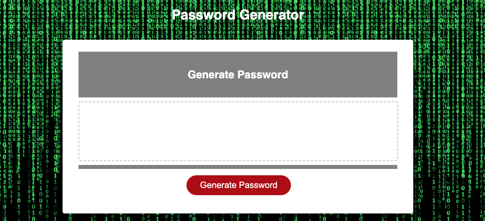
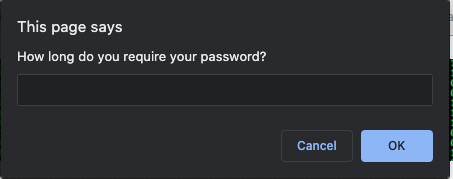
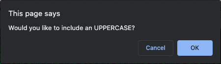
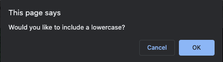
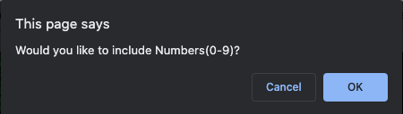
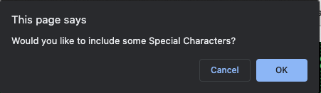
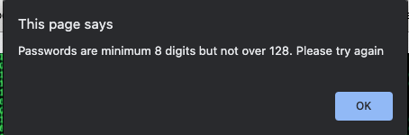

## Welcome to my Random Password Generator

This project requires an application that be used to generate random valued and strong password based on the criteria selection once they clicked the generate button.

### Criteria

- User can select how long the password will be.
- User to have an option to choose from Uppercase, lowercase, numbers and special characters that they want to be included on their password.
- Password must be validated and at least one character type should be selected.
- Password must be writen on the text area provided.

### Output
[Password Generator Page](https://criscel.github.io/Password-Generator/)

 

### Difficulties

I have encountered all kinds of difficulties while creating this program. from an array to a function that does not work, and a lot more. The group was a big help and so is google =)

### Jekyll Themes

This Page uses the layout and styles from the Jekyll that I have selected [Thanks Github! :)]

